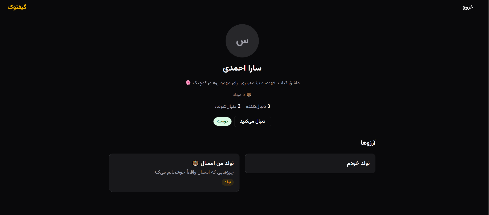

# 🎁 Giftook
این پروژه با فریم‌ورک Next.js 16 (مبتنی بر App Router)، Prisma 7 و پایگاه داده PostgreSQL ساخته شده، و یک دستیار هوش مصنوعی به نام Genie نیز برای پیشنهاد ایده‌های هدیه در آن گنجانده شده است.
---

## 📸 پیش‌نمایش

### صفحه اصلی

### داشبورد


### پروفایل عمومی کاربر


---

## ✨ امکانات

### مدیریت لیست آرزوها
- ساخت، ویرایش و حذف لیست‌های آرزو با مناسبت‌های مختلف (تولد، عروسی، تعطیلات و ...)
- سه سطح دسترسی: عمومی، خصوصی، و فقط با لینک
- اشتراک‌گذاری لیست از طریق لینک اختصاصی
- آرشیو کردن لیست‌ها بدون حذف کامل
- فیلتر آیتم‌ها بر اساس اولویت و وضعیت رزرو

### رزرو هدیه
- رزرو آیتم توسط کاربران عضو یا مهمان (بدون نیاز به حساب کاربری)
- امکان لغو رزرو توسط رزروکننده یا صاحب لیست
- ثبت اطلاعات خرید پس از رزرو (لینک تصویر رسید، آدرس ارسال، کد رهگیری پستی)
- نوتیفیکیشن ایمیلی خودکار به صاحب لیست هنگام رزرو یک آیتم
- حفظ ناشناسی رزروکننده مطابق تنظیمات صاحب لیست

### Genie — دستیار هوش مصنوعی پیشنهاد هدیه
- تولید ۶ پیشنهاد هدیه واقعی و متناسب با توصیف گیرنده، بودجه و مناسبت
- خروجی کاملاً فارسی با قیمت تخمینی به تومان
- حالت مکالمه‌ای برای اصلاح پیشنهادها ("ارزون‌تر پیشنهاد بده"، "گزینه‌های دیگری نشون بده")
- محدودیت روزانه قابل‌تنظیم با نمایش سهمیه باقی‌مانده به کاربر
- افزودن مستقیم هر پیشنهاد به لیست با یک کلیک

### پروفایل و شبکه اجتماعی
- پروفایل عمومی و خصوصی با بیوگرافی و تاریخ تولد (تقویم شمسی)
- سیستم دنبال‌کردن کاربران؛ دنبال‌کردن متقابل به‌عنوان «دوستی» شناسایی می‌شود
- نمایش لیست دنبال‌کننده‌ها، دنبال‌شونده‌ها و دوستان
- ویجت «تولد نزدیک دوستان» در داشبورد

### داشبورد و آمار
- نمای کلی از تعداد لیست‌ها، آیتم‌ها، آیتم‌های رزروشده و درصد پیشرفت
- تب‌بندی لیست‌های فعال و آرشیوشده با صفحه‌بندی

---

## 🛠 تکنولوژی‌ها

| بخش | تکنولوژی |
|---|---|
| فریم‌ورک | Next.js 16 (App Router) |
| زبان | JavaScript / TypeScript |
| پایگاه داده | PostgreSQL + Prisma 7 (با `@prisma/adapter-pg`) |
| احراز هویت | NextAuth v5 (Google + Credentials) |
| استایل | Tailwind CSS 4 + shadcn/ui |
| هوش مصنوعی | OpenRouter API (مدل‌های رایگان) |
| ایمیل | Nodemailer (Gmail SMTP) |
| تست | Vitest + Testing Library + fast-check (property-based testing) |

---

## 🚀 راه‌اندازی پروژه

### پیش‌نیازها
- Node.js نسخه ۲۰ به بالا
- یک نمونه در حال اجرای PostgreSQL

### مراحل

1. نصب پکیج‌ها:
   ```bash
   npm install
   ```

2. فایل `.env.example` را کپی کرده و به `.env` تغییر نام دهید، سپس مقادیر را پر کنید:
   ```bash
   cp .env.example .env
   ```

   | متغیر | توضیح |
   |---|---|
   | `DATABASE_URL` | آدرس اتصال به PostgreSQL |
   | `GOOGLE_CLIENT_ID` / `GOOGLE_CLIENT_SECRET` | برای ورود با گوگل (اختیاری) |
   | `OPENROUTER_API_KEY` | کلید رایگان از [openrouter.ai](https://openrouter.ai/keys) برای Genie |
   | `GENIE_MODEL` | مدل مورد استفاده Genie، پیش‌فرض: `openrouter/free` |
   | `GENIE_DAILY_LIMIT` | سقف درخواست روزانه هر کاربر به Genie |
   | `GMAIL_USER` / `GMAIL_APP_PASSWORD` | برای ارسال ایمیل نوتیفیکیشن رزرو ([راهنمای ساخت App Password](https://myaccount.google.com/apppasswords)) |
   | `APP_URL` | آدرس پایه اپلیکیشن، برای محیط توسعه: `http://localhost:3000` |

3. اجرای migration‌ها:
   ```bash
   npx prisma migrate dev
   ```

4. (اختیاری) پر کردن دیتابیس با داده نمونه برای دمو:
   ```bash
   npx prisma db seed
   ```

5. اجرای پروژه:
   ```bash
   npm run dev
   ```

   پروژه روی [http://localhost:3000](http://localhost:3000) در دسترس خواهد بود.

6. اجرای تست‌ها:
   ```bash
   npm run test
   # یا با گزارش پوشش کد
   npm run test:coverage
   ```

---

## 📁 ساختار پروژه

```
app/               مسیرهای صفحات و API (Next.js App Router)
components/        کامپوننت‌های React، دسته‌بندی‌شده بر اساس حوزه
services/          منطق تجاری و تعامل با دیتابیس (لایه سرویس)
lib/               ابزارهای مشترک: احراز هویت، اعتبارسنجی، خطاها، ایمیل
prisma/            schema، migration‌ها و seed
```

الگوی هر درخواست: `route.js` (اعتبارسنجی ورودی + احراز هویت) → `services/*.service.js` (منطق و دسترسی به دیتابیس) → پاسخ استاندارد از طریق `handleServiceError`.

---

## ⚠️ محدودیت‌های شناخته‌شده

- قیمت پیشنهادهای Genie تخمینی است، نه لحظه‌ای — چون اتصال به API فروشگاه‌های آنلاین برای قیمت زنده نیاز به قرارداد جداگانه دارد.
- سهمیه روزانه Genie به‌صورت درون‌حافظه‌ای (in-memory) نگه‌داری می‌شود و با ری‌استارت سرور بازنشانی می‌شود — تصمیمی آگاهانه برای سادگی پروژه.
- مدرک خرید (تصویر رسید) به‌صورت لینک URL ثبت می‌شود، نه آپلود مستقیم فایل.
